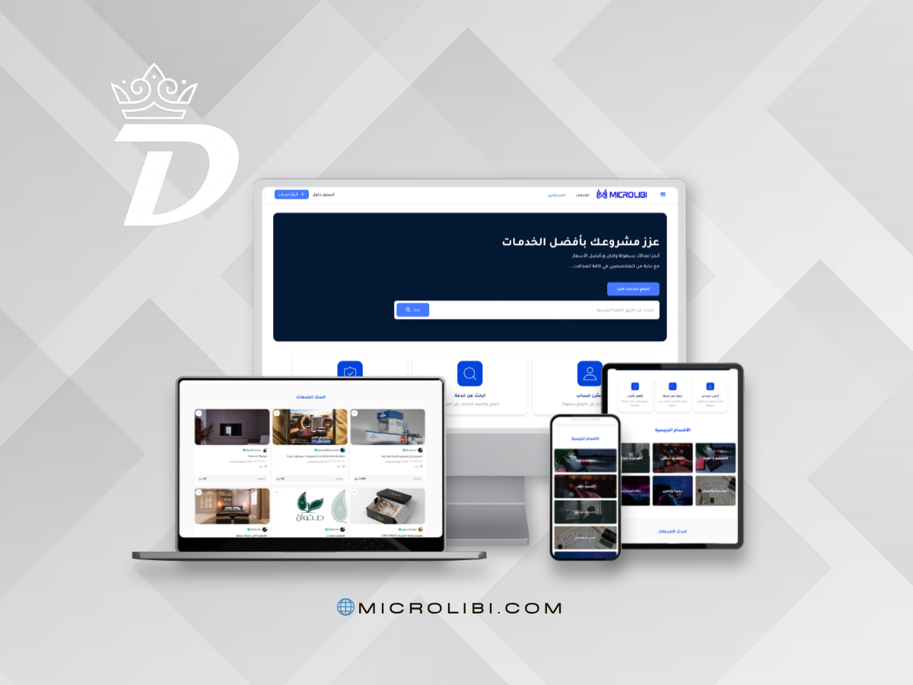
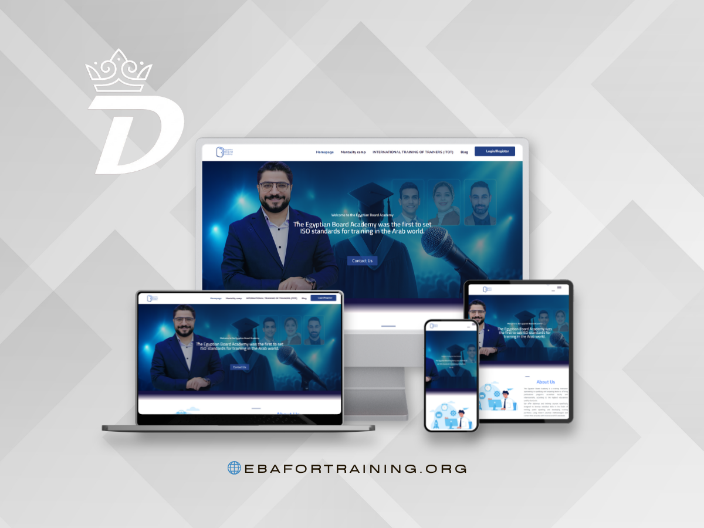
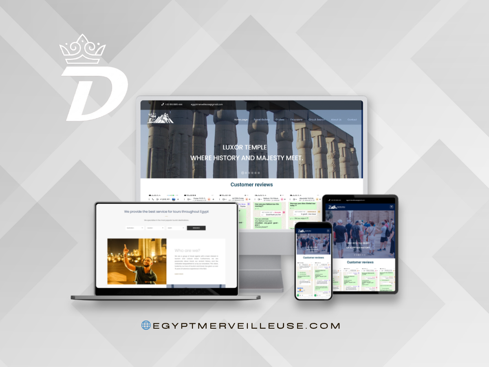
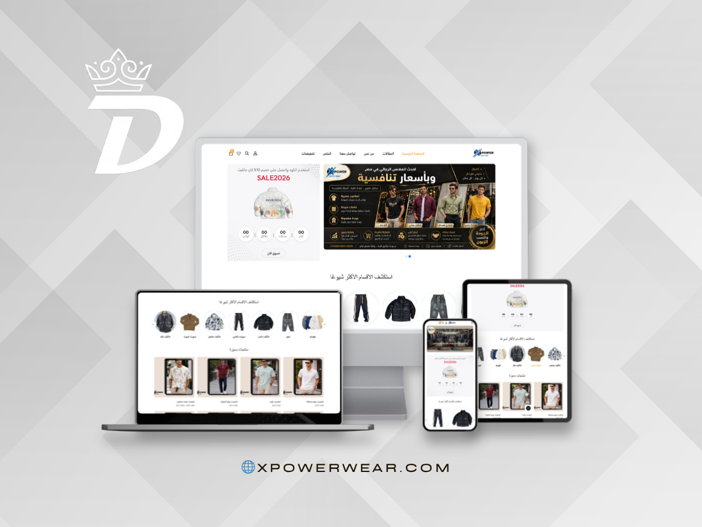

## Creative Full Stack Developer | UI/UX Enthusiast

  
  
  

---

<h2 align="center">About Me</h2>

I am a hardworking and detail-oriented <strong>Full Stack Developer</strong> with a bachelor's degree in <strong>Computer Science</strong>. I build responsive, scalable web applications using <strong>React</strong>, <strong>Laravel</strong>, <strong>Node.js</strong>, and <strong>MySQL</strong>.

My background in <strong>Photoshop</strong> and <strong>Adobe XD</strong> helps me bridge development and design, turning ideas into clean, polished, user-friendly interfaces.

---

<h2 align="center">Tech Stack</h2>

|                                                                Frontend                                                                 |                                                          Backend                                                           |                                                         Database                                                         |                                                           Creative & Tools                                                           |
| :-------------------------------------------------------------------------------------------------------------------------------------: | :------------------------------------------------------------------------------------------------------------------------: | :----------------------------------------------------------------------------------------------------------------------: | :----------------------------------------------------------------------------------------------------------------------------------: |
|                      |    |        |  |
|  |  |  |         |
|        |               |             |                 |

---

<h2 align="center">Portfolio Highlights</h2>

  

    
  

  

    
  

  

    
  

  

    
  

---

<h2 align="center">GitHub Activity</h2>

  

---

<h2 align="center">Connect With Me</h2>

  

