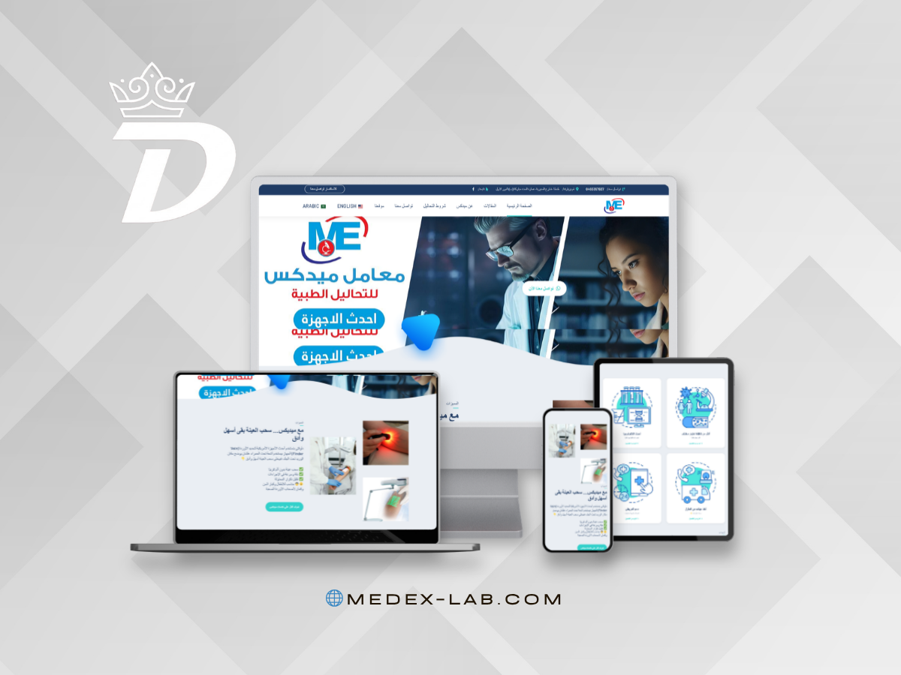

## Creative Full Stack Developer | UI/UX Enthusiast

  
  
  

---

## About Me

I am a hardworking and detail-oriented **Full Stack Developer** with a bachelor's degree in **Computer Science**. I build responsive, scalable web applications using **React**, **Laravel**, **Node.js**, and **MySQL**.

My background in **Photoshop** and **Adobe XD** helps me bridge development and design, turning ideas into clean, polished, user-friendly interfaces.

---

## Tech Stack

| Frontend | Backend | Database | Creative & Tools |
| --- | --- | --- | --- |
|  |  |  |  |
|  |  |  |  |
|  |  |  |  |

---

## Portfolio Highlights

<table>
  <tr>
    <td width="50%">
      
      <h3 align="center">Microlibi</h3>
      
Service marketplace website with responsive layouts for desktop, tablet, and mobile.

    </td>
    <td width="50%">
      
      <h3 align="center">Egyptian Board Academy</h3>
      
Training academy platform with a polished landing experience and multi-device design.

    </td>
  </tr>
  <tr>
    <td width="50%">
      
      <h3 align="center">Egypt Merveilleuse</h3>
      
Tourism website focused on travel discovery, customer reviews, and clean presentation.

    </td>
    <td width="50%">
      
      <h3 align="center">Medex Lab</h3>
      
Medical laboratory website with Arabic content, service sections, and responsive pages.

    </td>
  </tr>
  <tr>
    <td width="50%">
      
      <h3 align="center">X Power Wear</h3>
      
E-commerce fashion website with product categories, campaigns, and mobile-first shopping UI.

    </td>
    <td width="50%" align="center">
        
      <h3>More Work Coming Soon</h3>
      
New projects, case studies, and UI previews will be added here.

    </td>
  </tr>
</table>

---

## GitHub Activity

  

---

## Connect With Me

  

